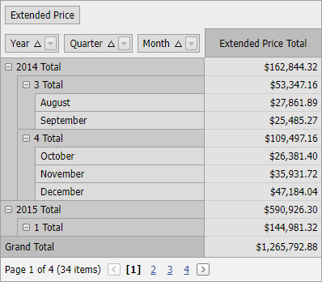

<!-- default badges list -->

<!-- default badges end -->
# Pivot Grid for Web Forms - How to Group Date-Time Values

This example shows how to group date-time values.

Multiple Pivot Grid fields are bound to the same data field - `OrderDate`. The [DataSourceColumnBindingBase.GroupInterval](https://docs.devexpress.com/CoreLibraries/DevExpress.PivotGrid.DataBinding.DataSourceColumnBindingBase.GroupInterval) property is used to create a _Year → Quarter → Month_ hierarchy.

## Files to Look At

- [Default.aspx](./CS/ASPxPivotGrid_GroupDateTimeValues/Default.aspx) (VB: [Default.aspx](./VB/ASPxPivotGrid_GroupDateTimeValues/Default.aspx))

## Documentation

- [Grouping in Pivot Grid](https://docs.devexpress.com/AspNet/7268/components/pivot-grid/data-shaping/grouping)

## More Examples

- [Pivot Grid for WPF - How to Group Date-Time Values](https://github.com/DevExpress-Examples/how-to-group-date-time-values-e2131)
- [Pivot Grid for Web Forms - Custom Group Intervals](https://github.com/DevExpress-Examples/how-to-implement-custom-group-intervals-e2132)
